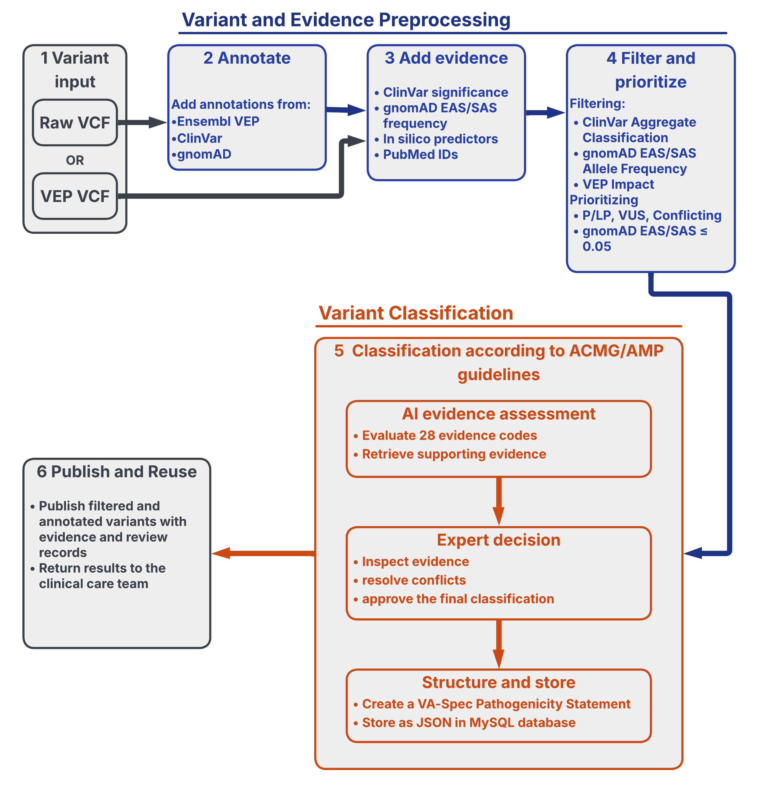
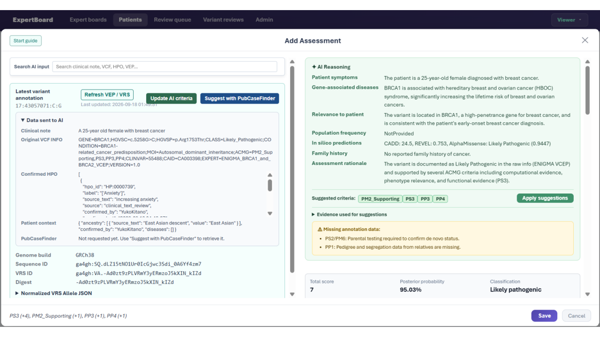
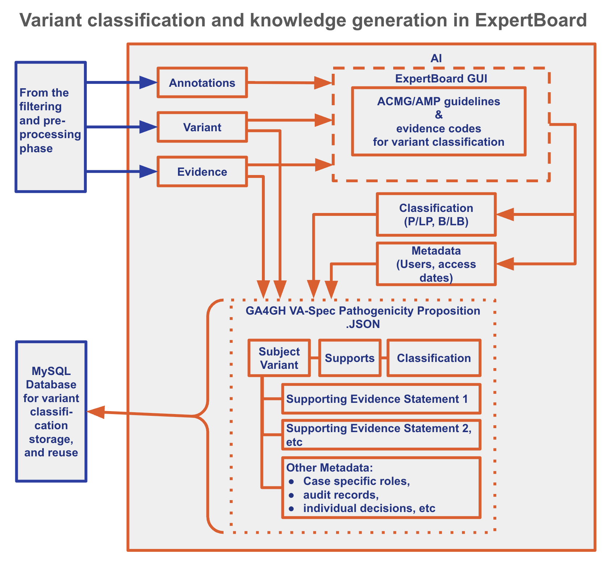

# Abstract

Genome and exome sequencing have transformed rare disease diagnosis, and yet converting large variant sets into evidence-backed interpretations remains labor-intensive and fragmented. Across Asia, population genomic resources and specialist expertise are expanding, but variant analysis workflows and the reuse of reviewed knowledge are often fragmented across institutions and countries. We argue that the most useful near-term role of artificial intelligence (AI) in this context is not autonomous variant classification, but to harmonize analysis workflows and data sharing. Building on a collaborative platform developed by participants from institutions across Japan, Singapore, the Philippines, Thailand, and elsewhere, we propose a common workflow connecting variant prioritization and evidence organization, structured expert review, and reviewed-knowledge sharing. We find that AI can help support multilingual phenotype structuring, population-aware variant prioritization, literature and evidence retrieval, and the reuse of previous expert-reviewed records, while final evidence assessment remains human expert-governed. Country-operated platforms can preserve local governance and population contexts while exchanging standardized evidence and interpretations and, when appropriate, contributing records to global knowledge resources. Initial implementations for variant prioritization and an expert review workspace provide a practical foundation for this model. This Perspective outlines where AI can add value for variant analysis workflows, with  human judgment remaining decisive, and how a regionally connected expert-panel network could be built to harmonize workflows and data sharing across Asia. 

**Keywords:** artificial intelligence; rare disease; variant interpretation; expert panel; genomic medicine; Asia

# Introduction

Whole genome and exome sequencing have become important approaches for investigating rare and undiagnosed diseases, where meta-analyses and national implementation studies have demonstrated their diagnostic value [@Clark2018-lt; @100000_Genomes_Project_Pilot_Investigators2021-dq]. In a typical genome or exome analysis workflow, a large initial set of variants is progressively filtered through quality control, normalization, annotation, and assessment of molecular consequence. Candidate variants are then prioritized using population allele frequencies, disease inheritance models, variant type, gene-disease associations, genotype-phenotype association, and clinical assertions [@Smedley2015-ih; @Kohler2021-ra; @Fujiwara2018-fg; @Shin2025-am]. For the remaining candidates, evidence from literature, functional studies, family segregation studies, and computational predictors must be assembled and evaluated. The ACMG/AMP framework provides standardized guidelines for evaluating and combining these evidence types, with subsequent work done and endorsed by the ClinGen Sequence Variant Interpretation (SVI) Working Group on refining and calibrating evidence strength and application [@Richards2015-ud; @Tavtigian2018-iu; @Pejaver2022-qh]. However, prioritization and automated annotation alone do not determine the final interpretation. Multidisciplinary experts must still assess whether each evidence type is applicable, sufficient, and consistent with patient presentation and mechanism of disease.

In North America and Europe, open-source databases and coordinated variant curation initiatives have increasingly improved and unified variant prioritization, collaborative analysis, expert review, and knowledge sharing. Tools like seqr and the RD-Connect Genome-Phenome Analysis Platform integrate variant filtering with phenotype-informed analysis and collaboration [@Pais2022-sp; @Laurie2022-eh], while the ClinGen Variant Curation Interface (VCI), ClinVar, PanelApp, and independent laboratory networks have supported structured curation and reuse of expert knowledge [@Rehm2015-it; @Landrum2025-wq; @Martin2019-er; @Harrison2017-mv]. The Australian Shariant platform further illustrates how structured evidence sharing can strengthen national collaboration, reduce burden of Variants of Uncertain Significance (VUS)  and support contribution to international resources [@Tudini2022-wg].

Across Asia, genomic medicine expertise and population resources are also expanding. People of non-European ancestry have historically been underrepresented in genomic reference data and databases[@Popejoy2016-ev], but national efforts such as the SG10K_Health project in Singapore, the Thai Reference Exome, and the Japanese jMorp and TogoVar resources are improving access to population-specific allele frequencies and ancestry context [@Wu2019-co; @Chan2022-qd; @Shotelersuk2021-fp; @Tadaka2024-oa; @Mitsuhashi2022-ge]. These resources can substantially change how a variant is prioritized or how local population evidence is  incorporated. Yet the broader workflow remains fragmented: institutions use different pipelines, thresholds, databases, review processes, and mechanisms for annotating, prioritizing, curating and recording expert reasoning. Regional resources were created for different purposes and do not themselves provide a shared pathway from local utilization to collaborative review and knowledge sharing.

Here, AI can create an opportunity to bridge these gaps, but its role needs to be carefully defined. Large language models (LLMs) can extract phenotypes, summarize literature, and generate diagnostic or gene-ranking hypotheses, while computer vision and other multimodal approaches can add complementary phenotypic signals [@Kim2024-sp; @Garcia2025-qa; @Hsieh2022-oh]. Generative AI is also beginning to reduce the burden of variant-level literature review [Twede2026-rw]. At the same time, recent benchmarking shows that general-purpose LLMs do not consistently outperform established rare-disease decision-support tools, and their outputs can be biased toward well-studied genes or depend strongly on prompt and input representation [23,27]. These observations argue against positioning AI as an autonomous replacement for established bioinformatics or expert review.

AI creates an opportunity to bridge these gaps, but its role needs to be carefully defined. Large language models can extract phenotypes, summarize literature, and generate diagnostic or gene-ranking hypotheses, while computer vision and other multimodal approaches can add complementary phenotypic signals [@Kim2024-sp; @Garcia2025-qa; @Hsieh2022-oh]. Generative AI is also beginning to reduce the burden of variant-level literature review [Twede2026-rw]. At the same time, recent benchmarking shows that general-purpose LLMs do not consistently outperform established rare-disease decision-support tools, and their outputs can be biased toward well-studied genes or depend strongly on prompt and input representation [@Kim2024-sp; @Reese2026-nz]. These observations argue against positioning AI as an autonomous replacement for established bioinformatics or expert review.

Our perspective is therefore that AI should function as a connective layer across the different stages of the variant analysis and data sharing workflow. It should help transform unstructured information into reviewable evidence, make regional context easier to understand and use, and retrieve prior knowledge to reduce repetitive work, while preserving provenance and keeping final interpretation under expert control. A multidisciplinary research meeting hosted in Singapore in July 2026 involving participants from institutions in Japan, Singapore, the Philippines, and Thailand provided a practical setting in which to develop this concept through workflow comparison and prototype implementation. A continuation of this effort in the 2026 BioHackathon Japan in September 2026 yielded a model that connects multiple stages of analysis, including variant prioritization and evidence organization, structured expert review, and reviewed-knowledge sharing.

# ExpertBoard: Multi-stage variant analysis workflow

The current prototype of ExpertBoard expects a standard variant call format (VCF) file as input. Its purpose is not to replace established WGS/WES pipelines, but to connect their outputs to expert interpretation and knowledge reuse that can be shared across the region. Figure 1 shows a high-level representation of ExpertBoard’s variant analysis workflow.

**Figure 1:** Graphical representation of the Multi-Stage Variant Analysis Workflow on the ExpertBoard

First, variant annotation and prioritization reduces a large call set to a reviewable shortlist. Global and regional population allele frequencies, molecular consequences, gene-disease relationships, disease inheritance patterns, genotype-phenotype associations, previous assertions, computational predictions, and literature-derived evidence can all contribute. The output should not be only a ranking; it should preserve why each candidate was selected or removed, and which data sources and versions were used.  

Next, evidence organization and variant curation assigns a pathogenicity classification to each shortlisted variant. Curators can review and select the relevant ACMG/AMP criteria at their preferred strength and record supporting rationale as free text. Existing VEP annotations and links to complementary evidence sources are integrated into the workflow to support curation. AI-assisted evidence gathering is added to this process while ensuring that the curators retain control over the application and interpretation of those suggestions. The platform automatically computes the overall ACMG/AMP classification using the Bayesian framework and point-based evidence weighting recommended by the ClinGen SVI Working Group, providing a transparent and reproducible link between the underlying evidence and the final classification (Figure 2).

**Figure 2:** Screenshot of ExpertBoard prototype showing the AI-suggested ACMG/AMP criteria, with corresponding reasoning and evidence to facilitate curation.

Then, structured expert review allows multidisciplinary reviewers to inspect the underlying evidence, accept, reject, modify, or defer the proposed classifications, and record uncertainty or request additional information. The platform should preserve individual positions and disagreements until a final consensus is reached, rather than collapsing them prematurely into a single label.

Finally, reviewed-knowledge sharing turns approved outcomes into reusable knowledge records. Population observations, literature evidence, functional findings, accepted or rejected evidence criteria, rationale, uncertainty, and re-evaluation triggers can become useful beyond the original case when governance permits.

All stages are tightly interconnected. A ranking tool cannot perform without having the relevant information annotated, a bioinformatician cannot select a prioritised variant list confidently if the basis of ranking is unclear. Likewise, a curator cannot assign a classification to the shortlisted variants without gathering further evidence, and the expert board cannot approve a classification without the evidence collated and documented clearly. Ultimately, expert reasoning also has limited collective value if it is not shared in a regulated and standardized format.

# The role of AI

## From multilingual clinical notes to structured phenotypes

Clinical phenotype information is often incomplete, multilingual, and embedded in free text. This is a natural entry point for NLP and LLM-based support. Retrieval-augmented approaches have already shown that LLMs can improve automated assignment of HPO terms when grounded in curated phenotype knowledge [@Garcia2025-qa]. In an Asian setting, this function is particularly relevant because clinical notes, case reports, and supporting literature may span multiple languages. The important design choice is not simply whether or not an LLM can generate HPO terms. Each proposed phenotype should remain linked to the source text, and reviewers should be able to mark it as accepted, rejected, or pending. AI should therefore prepare a structured phenotype profile for expert confirmation rather than silently convert narrative text into ground truth. Multimodal evidence can also complement structured phenotyping. For instance, facial-phenotype matching systems such as GestaltMatcher illustrate how image-based representations can support rare-disease matching [@Hsieh2022-oh].

Therefore, we tested our ExpertBoard’s current AI analysis tool, Ollama [@Marcondes2025] which serves Gemma4, on six different languages, namely English, Malay, Tamil, Simplified Chinese, Tagalog and Japanese. The tool successfully managed to read the clinical notes for all six languages and integrated the extracted HPO terms and relevant clinical notes into its suggestions for applicable ACMG/AMP criteria.

## Population-aware candidate prioritization

AI can also assist in organizing the variety of signals used for variant prioritization. A useful system should be able to summarize why a variant rose or fell in rank, identify conflicts among population resources, and incorporate phenotype or inheritance assumptions that materially affect prioritization. However, AI should not simply replace established variant prioritization algorithms. Studies of LLM-based gene prioritization and broader rare-disease diagnostic benchmarking show that current LLMs remain inconsistent and cannot outperform specialized tools [@Kim2024-sp; @Reese2026-nz].

For Asia, population context is central. A variant that appears rare in a global dataset may be a common polymorphism in a specific regional population, whereas absence from a local dataset may reflect limited sampling rather than pathogenicity. AI can make these differences easier to inspect, but disease prevalence, penetrance, inheritance, technical coverage, and ancestry context should still rely on expert consideration. The objective therefore should be to generate an explainable shortlist of priority variants for expert review, rather than simply producing an AI-assisted ranking of variants based on unclear or undocumented  criteria.

## Evidence retrieval and preparation for expert review
Evidence retrieval is one of the strongest near-term opportunities for generative AI. Rare-disease interpretation requires repeated searches across publications, variant databases, functional studies, and case reports. The Evidence Aggregator recently demonstrated that generative AI can systematically extract variant-level evidence from the literature and reduce expert review time while increasing the amount of evidence reviewed [@Twede2026-rw]. Rule-based automation such as AutoPVS1 similarly shows how specific ACMG/AMP evidence types can be computationally assessed while still requiring disease- and transcript-aware interpretation [@Xiang2020-xe].

A regional platform could use AI to identify relevant publications, extract reported variants and phenotypes, summarize functional assays and clinical evidence, detect potentially overlapping cases, and pre-populate the associated ACMG/AMP evidence codes. Every extracted item should carry a source, version, date, and confidence or review status. Correlated computational predictions must not be presented as independent evidence, and AI-generated summaries must never obscure contradictory primary sources [@Richards2015-ud; @Pejaver2022-qh].

## Reusing expert-reviewed knowledge
A less visible but potentially powerful role for AI is to make previous expert reasoning reusable. When a new case contains a previously reviewed variant, gene, phenotype pattern, or evidence source, semantic retrieval could surface earlier panel decisions together with the evidence that was accepted, rejected, or left unresolved. AI could also help identify when new literature or newly available regional allele frequency data should trigger re-evaluation.

This creates a learning system without asking AI to become the authority. The reusable asset is not only the final classification; it is the structured history of how experts reached, qualified, or disagreed with that conclusion.

# Expert governance remains the decision layer

The ACMG/AMP framework already illustrates why many evidence types cannot be interpreted independently of context [@Richards2015-ud]. Loss-of-function evidence depends on disease mechanism and transcript relevance; population evidence depends on disease incidence, inheritance patterns, penetrance, and ancestry; de novo and segregation evidence depends on family relationships and testing; phenotype specificity requires clinical judgment; and functional studies require assessment of assay validity. Computational support can prepare these elements, but the decision to apply them remains contextual.

The platform should therefore keep four objects distinct: a machine-generated proposal, an individual reviewer assessment, a panel-level outcome, and a formal clinical report. Source-linked and versioned AI outputs, explicit accept/reject/pending states, preservation of dissent, and auditable changes are more important than a fluent generated explanation. This form of traceability also makes it possible to learn where AI is useful and where it repeatedly fails.

The same principle applies to privacy and governance. Full genomic and clinical records should remain in local or trusted environments unless sharing is authorized. The network should exchange the minimum information needed for a defined review or knowledge-sharing task, recognizing that rare variants and distinctive phenotype combinations may remain identifiable even when direct identifiers are removed.

# A regional network of nationally-operated panels

The long-term objective should not be a single “Asian expert panel” that produces one regional answer. Clinical pathways, languages, population resources, data-use rules, and institutional responsibilities differ substantially across countries. A more practical model is a network of country-operated expert panels using a common technical and information foundation.

To provide this foundation, the platform has adopted the Global Alliance for Genomics and Health Variant Annotation Specification (GA4GH VA-Spec). VA-Spec provides a standardized, machine-readable framework for representing a variant, a classification proposition, the evidence supporting that proposition, and the provenance of the resulting interpretation. As shown in Figure 3, these elements can be assembled into a portable and readily validated genomic knowledge artifact serialized as JSON, allowing the substance and history of an interpretation to move between otherwise heterogeneous tools and institutions without being reduced to a classification label alone.

**Figure 3:** Variant and evidence item information used in the process of variant classification are stored alongside the final classification and relevant metadata.

Adopting VA-Spec also connects the platform to a broader international ecosystem of genomic knowledge systems. The specification is already used or being implemented in efforts associated with ClinVar, ClinGen, CIViC, the Variant Interpretation for Cancer Consortium Meta-Knowledgebase (VICC MetaKB), and MaveDB, among others. Consequently, knowledge artifacts produced by the platform can be exchanged with regional peers with minimal transformation and, when permitted, contributed to larger resources such as ClinVar to support global and FAIR reuse of genomic knowledge. This interoperability is a capability, not a sharing requirement: participating institutions retain authority over what is shared, with whom, and for what purpose. The design therefore lowers the technical barrier to future exchange at scale without weakening national governance, institutional control, or data sovereignty.

Each country can operate panels under local governance, accumulate reviewed evidence, and decide which records can be shared. Standardized records can then allow panels in different countries to compare evidence and interpretations, understand why conclusions differ, and conduct cross-border review when useful. Agreement is valuable, but disagreement is also information: it may reveal different population frequencies, disease and biological assumptions, evidence dates, or local policies.

This regional layer should connect outward rather than become a new silo. Appropriate expert-reviewed records from Asian institutions should ultimately be contributed to established international variant knowledge resources, while global evidence should flow back into country-level review. The goal is a knowledge feedback cycle: **local evidence** → **national expert review** → **regional exchange** → **global contribution** → **updated local review**.

# A practical starting point for collaborative development in Asia

The collaborative work initialised during the MedHackathon 2026 hosted in Singapore provided a concrete starting point for this model. Participants compared variant-analysis practices and regional resources and developed components around the same multi-stage architecture. A VEP-based parser demonstrated how heterogeneous annotations, including molecular consequence, computational predictions, previous assertions, and global and regional allele frequencies, could be organized into ranked candidate outputs. An ExpertBoard prototype provided a workspace for exploring how phenotype and variant evidence, reviewer roles, individual positions, and review history can be represented.

More importantly, prototyping exposed operational requirements that are easy to overlook in a purely conceptual design. Roles need to be assigned per case rather than globally; individual agreement, disagreement, and abstention should be preserved; high-stakes finalization should be controlled; concurrent edits must not silently overwrite one another; and audit records should capture what changed, by whom, and when. The work also reinforced the need to distinguish local case data, restricted review information, and knowledge suitable for broader reuse.

These implementations are useful not because they constitute a finished regional platform, but because they define a practical interface on which AI functions can be layered: structured inputs for retrieval, provenance for grounded generation, explicit review actions for expert input, and reusable outputs for regional learning.

# Future prospects

This Perspective summarizes the work initiated during the two 2026 hackathons hosted in Singapore and Japan. The current ExpertBoard prototype is still in the pilot phase and requires benchmarking and fine tuning. Future work will encompass the following sections:

*Benchmarking of AI components*
AI components should be benchmarked on the tasks for which they are actually intended: phenotype extraction, variant ranking, literature retrieval, evidence extraction, and retrieval of previous evidence and classifications. Evaluation should be language- and population-aware rather than assuming that performance measured on English-language or predominantly European datasets transfers directly across Asia.

*Pilot implementation and evaluation*
Country-level pilots should evaluate the complete human-AI workflow, not only model accuracy. Relevant outcomes include reducing reviewer workload and turnaround time, increasing evidence coverage, improving documentation of variant interpretations, workflow reproducibility, and reducing discrepancies between AI-proposed and expert determined classifications.

*Platform management and governance*
Regional governance and global contribution should be designed together. The system should support correction, withdrawal, attribution, re-evaluation, and explicit data-use conditions while creating straightforward pathways for appropriate reviewed evidence to reach international knowledge resources.

*Inclusion of localized population databases*
The current prototype of ExpertBoard primarily uses allele frequency information from gnomAD, particularly for East Asian (EAS) and South Asian (SAS) populations, for variant prioritization. However, as more country-specific population databases become available, the workflow should be able to utilize these databases to better incorporate local context in variant prioritization.

*Support for the ACMG 4.0 classification system*
We anticipate that the ACMG/AMP 4.0 guidelines for variant pathogenicity classification will be finalized soon. The team will therefore work on a module to implement these guidelines once published, while keeping the classifications based off the current version (ACMG/AMP 3.0) intact both for backwards compatibility and a systematic comparison of old and new classifications.

# Conclusion

AI has the potential to improve rare-disease variant review, but its greatest near-term value may be as a facilitator rather than an autonomous decision-maker. Through multilingual information structuring, population-aware variant prioritization, literature and evidence retrieval, expert review, and reuse of previous decisions, AI can reduce the friction inherent to collaborative, international, and multilingual clinical efforts. A common platform operated by country-level expert panels could preserve local governance and regional population context while enabling approved and standardized evidence to circulate across Asia and into the global variant knowledge ecosystem. The collaborative development described here provides a practical foundation for that model.

# Software and data availability

The ExpertBoard prototype is available at:

- https://github.com/PubCaseFinder/expertboard

The Expert Review Workspace prototype was developed on the `feature/llm-integration` branch:

- https://github.com/PubCaseFinder/expertboard/tree/feature/llm-integration

Patient-derived genomic or clinical data should not be deposited or exchanged unless sharing is permitted under the applicable consent, ethics, privacy, security, and institutional requirements.

# Declaration of Generative AI Use

During the preparation of this work, the corresponding author used ChatGPT (OpenAI) to assist with manuscript organization, drafting, and language revision. The authors reviewed and edited all AI-generated content and accept full responsibility for the published material.

# Acknowledgements

We thank the organizers, local hosts, sponsors, and participants of MedHackathon Asia 2026, held in Singapore from 27-31 July 2026, and the members of the variant, phenotype, and system-design workstreams for contributing requirements, examples, and implementation discussions.

We thank the organizers, local hosts, sponsors, and participants of BioHackathon 2026 Held in Japan from 13-19 September 2026 for contributing requirements, examples, documentation, figures, use cases, and implementation discussions.

The descriptions of countries, institutions, and resources in this Perspective reflect collaborative discussions and do not represent official national policy, clinical standards, or the formal position of any organization.

# Author contributions

**Conceptualization:** TO BE COMPLETED.  
**Software:** TO BE COMPLETED.  
**Methodology and requirements analysis:** TO BE COMPLETED.  
**Variant workstream:** TO BE COMPLETED.  
**Phenotype workstream:** TO BE COMPLETED.  
**System-design workstream:** TO BE COMPLETED.  
**Visualization:** TO BE COMPLETED.  
**Writing - original draft:** TO BE COMPLETED.  
**Writing - review and editing:** All authors.

# Financial support and sponsorship

TO BE COMPLETED.

# Ethical approval and consent to participate

No new patient-level research analysis is reported in this Perspective. Any future use of patient-derived genomic or clinical information must follow applicable consent, ethics-review, privacy, security, and institutional requirements.

# Consent for publication

Not applicable.

# Competing interests

The authors declare no competing interests, subject to confirmation by all authors.

# References
